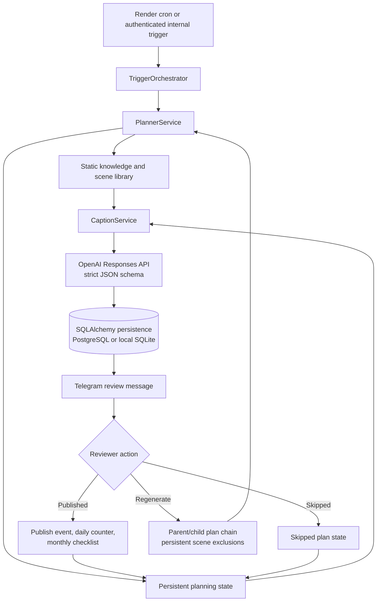

# Elise Verne Content OS

A stateful content-planning backend for a virtual influencer. It combines deterministic scene rotation, schema-constrained LLM generation, database-backed workflow memory, and a Telegram human-review loop without pretending that image creation or Instagram publishing is autonomous.

## Overview

Content operations need more than a prompt and a scheduler. A useful system must preserve character and brand consistency, avoid repeating recent material, respect publishing limits, carry regeneration feedback forward, and keep a human responsible for visual quality and final publication.

Elise Content OS models that process as a persistent workflow:

- schedule-aware triggers create content plans for morning, afternoon, or evening windows;
- a planner selects a scene using time-of-day groups, recent-history exclusions, monthly checklist priorities, and deterministic tie-breaking;
- OpenAI produces a structured package containing an image brief, caption, hashtags, formula metadata, and publishing notes;
- every plan is persisted before it is sent to Telegram for review;
- reviewer actions update plan state, counters, checklist progress, and future regeneration constraints.

The backend prepares and tracks the content package. Final image generation, visual quality control, and Instagram publishing remain manual.

## Architecture



## End-to-End Workflow

1. A CLI job or token-protected internal endpoint starts a `morning`, `afternoon`, or `evening` trigger.
2. `PlannerService` blocks Sunday runs and stops when the Dubai-local daily story target has been reached.
3. The trigger maps to eligible scene groups. Published scenes from the previous 14 days are excluded when possible; explicit regeneration exclusions are never relaxed.
4. Pending monthly checklist items can rank relevant scenes by keyword. Otherwise, a hash of local date, trigger window, and explicit exclusions makes selection deterministic for the same inputs.
5. The selected scene, character state, brand voice, monthly context, current accessories, and up to ten recent captions are assembled for generation.
6. The OpenAI Responses API returns a strict JSON-schema package, which is validated again with Pydantic and enriched with non-optional visual identity constraints.
7. A pending `ContentPlan` is committed before its review message is sent to Telegram.
8. Telegram callbacks mark the plan as `published`, `skipped`, or `regenerate_requested`. Callback IDs are stored uniquely so duplicate deliveries do not increment counters twice.
9. Regeneration creates a child plan and carries the complete scene-exclusion chain forward, preventing earlier ideas in the chain from being selected again.
10. Weekly summaries and manually entered analytics snapshots provide lightweight operational review data.

## Core Components

| Component | Responsibility | State interaction |
| --- | --- | --- |
| `TriggerOrchestrator` | Coordinates planning, transaction boundaries, notification delivery, logging, and best-effort failure alerts. | Commits a generated plan; rolls back planner failures. |
| `PlannerService` | Enforces schedule rules, daily limits, scene rotation, checklist-aware ranking, and deterministic selection. | Reads scenes, recent published plans, counters, and checklist items; creates pending plans. |
| `CaptionService` | Builds generation context and validates the structured content package. | Reads static knowledge and recent captions; returns an in-memory `CaptionPackage`. |
| `KnowledgeLoader` | Loads character state, monthly tracker data, brand voice, and scene records from configured repository/workspace paths. | Converts file-backed knowledge into seed and prompt inputs. |
| `MemoryService` | Applies Telegram feedback with idempotent event handling and regeneration lineage. | Updates plan status, publish events, daily counters, checklist progress, and child plans. |
| `TelegramService` | Sends review packages, inline actions, visual-QC guidance, callback acknowledgements, and admin alerts. | Uses the Telegram Bot API; workflow state remains in the database. |
| Analytics and weekly review | Stores manual platform metrics and summarizes plan outcomes for the current week. | Writes analytics snapshots and weekly review records. |

## Stateful Planning

The planner separates soft recency rules from hard reviewer feedback:

- Morning plans use close-up or detail scenes; afternoon plans use waist-up or full-body scenes; evening plans use close-up or waist-up scenes.
- Published scenes created within the previous 14 days are excluded first. If that removes every candidate, the planner logs a warning and retries without only the recent-history filter.
- Scene IDs accumulated during a regeneration chain are hard exclusions and are never removed by that fallback.
- The first pending monthly checklist item can prioritize matching scenes using explicit keyword scoring and stable scene-ID ordering.
- With no checklist match, SHA-256-based selection produces the same scene for the same local date, trigger window, and hard-exclusion set.
- A Dubai-local `DailyCounter` caps planning at the configurable story target (four by default), and Sunday is treated as a silent day.

This makes content rotation repeat-aware and reproducible while still allowing the reviewer to force a genuinely different follow-up.

## Structured AI Generation

`CaptionService` uses the OpenAI Responses API with a strict JSON schema. The returned object includes:

- content type;
- image brief;
- one-to-three-line caption;
- caption formula;
- three to five hashtags;
- publishing note;
- optional checklist, watch, and shoe metadata.

Pydantic applies a second validation layer for caption length, formatting, forbidden voice terms, hashtags, punctuation, and visible brand names. Required character and shot-distance constraints are injected into the image brief even if the model omits them.

Generation uses a 30-second client timeout and up to three attempts per configured model with 1/2/4-second exponential delays. The service classifies schema, rate-limit, timeout, connection, server, and API status failures; a model-unavailable response advances immediately to the configured fallback model. Exhaustion raises a typed generation error for orchestration-level logging and alerting.

The checked-in defaults currently use `gpt-5.4-mini` for both primary and fallback settings. Operators can configure distinct models through environment variables.

## Knowledge and Persistence

The system intentionally separates two kinds of context:

**File-backed knowledge**

- brand voice rules;
- character and visual identity state;
- monthly content tracker;
- scene prompts and training captions.

**Live database state**

- scene catalog loaded by the idempotent upsert-style seeder;
- content plans and parent/child regeneration lineage;
- callback events and plan status;
- Dubai-local daily counters;
- monthly checklist progress;
- weekly reviews and manual analytics snapshots.

SQLAlchemy uses JSON columns locally and PostgreSQL `JSONB` variants in production. Alembic owns the schema, while configuration supports a pooled runtime URL and an optional direct migration URL. SQLite is the local default; the repository's Render configuration targets PostgreSQL/Neon.

## Human-in-the-Loop Review

Telegram receives the generated image brief, caption, hashtags, publishing note, and a visual-QC checklist. Inline callbacks use `published:<plan_id>`, `skipped:<plan_id>`, and `regenerate:<plan_id>` payloads.

- **Published** records the event, increments the local daily counter once, and advances a fulfilled monthly checklist item.
- **Skipped** records the decision without incrementing publishing state.
- **Regenerate** marks the original plan, appends its scene to hard exclusions, and creates a linked child plan.

The webhook does not publish to Instagram. It records the operator's decision after manual image generation, QC, and publication.

## API and Scheduling

| Interface | Purpose | Protection |
| --- | --- | --- |
| `GET /healthz` | Verifies database connectivity and reports configured timezone/model. | Public health endpoint. |
| `POST /internal/triggers/{trigger_time}` | Runs a planning trigger, with optional dry-run generation. | `X-Internal-Trigger-Token`. |
| `POST /internal/reviews/weekly` | Persists a weekly plan-outcome summary. | `X-Internal-Trigger-Token`. |
| `POST /telegram/webhook` | Processes Telegram callback updates. | `X-Telegram-Bot-Api-Secret-Token`. |

The checked-in [`render.yaml`](render.yaml) is a deployment blueprint: one FastAPI web service, three UTC cron jobs corresponding to `07:00`, `13:00`, and `19:30` in `Asia/Dubai`, plus a Monday weekly review. It also runs migrations and seed loading before deployment. The repository itself contains no deployment record proving that this blueprint is the currently active production environment.

## Tech Stack

- Python 3, FastAPI, Uvicorn, Pydantic
- OpenAI Python SDK and Responses API
- SQLAlchemy 2, Alembic, PostgreSQL/Neon, SQLite for local development
- HTTPX and the Telegram Bot API
- pytest and respx
- Render blueprint for web and cron workloads

## Project Status and Automation Boundary

| Area | Status |
| --- | --- |
| Trigger orchestration, stateful planning, structured content generation, persistence, Telegram review callbacks, regeneration, weekly summaries, manual analytics | Implemented in source |
| Image generation, final visual QC, Instagram publishing, analytics collection | Manual |
| Active hosted environment | Not verifiable from repository artifacts |

The public checkout currently includes `brand_voice.md` but does not include the character-state JSON, monthly tracker, or scene dataset expected by `KnowledgeLoader`. Consequently, seed and planner flows are not reproducible from this clone alone until those inputs are supplied. See the operations guide for the exact lookup paths.

## Local Development

```powershell
cd elise-content-os
python -m venv .venv
.venv\Scripts\pip.exe install -r requirements.txt
Copy-Item .env.example .env
.venv\Scripts\alembic.exe upgrade head
```

Before seeding, provide the required knowledge inputs described in [`elise-content-os/README.md`](elise-content-os/README.md). Then run:

```powershell
.venv\Scripts\python.exe -m app.cli seed
.venv\Scripts\python.exe -m app.cli trigger morning --dry-run
.venv\Scripts\uvicorn.exe app.main:app --reload
```

## Verification

Validation on a clean public clone:

- Python AST parse: **32 files passed**.
- Alembic upgrade through `0002_manual_analytics`: **passed** on SQLite.
- `GET /healthz`: **200 OK** against SQLite.
- pytest: **7 passed, 3 failed**. All three failures are caused by the missing character-state seed input during planner dry-runs.
- `python -m app.cli seed`: **blocked** by the missing monthly tracker after loading zero scene records.

No passing test count from the historical implementation plan is presented as current. The failing checks are a repository reproducibility issue, not a failure introduced by this documentation change.

## Security Notes

- Runtime credentials are environment-driven; `.env.example` contains placeholders only.
- Internal trigger and Telegram webhook endpoints reject missing or invalid header tokens.
- Callback event IDs have a database uniqueness constraint to protect publish counters from duplicate Telegram deliveries.
- Database URLs support separation between pooled application traffic and direct migration traffic.
- Never commit `.env` files, bot tokens, API keys, database URLs, service-account files, or production logs. Rotate any credential that may have been exposed before this repository snapshot.

## Repository Layout

```text
elise-content-os/
├── README.md                     # Portfolio and architecture overview
├── implementation plan.md        # Historical implementation snapshot
├── render.yaml                   # Render web/cron deployment blueprint
└── elise-content-os/             # Python application root
    ├── README.md                 # Development and operations guide
    ├── alembic/                  # Database migrations
    ├── app/
    │   ├── api/                  # Internal and Telegram endpoints
    │   ├── services/             # Planning, generation, memory, integrations
    │   └── utils/                # Time and request-token helpers
    ├── data/seed/                # Checked-in public knowledge subset
    ├── tests/                    # Planner, memory, quality, security, analytics
    └── requirements.txt
```

## Design Takeaways

- Deterministic planning and persistent exclusions handle repetition before the LLM is called.
- Structured generation is validated at both provider-schema and application-schema boundaries.
- Static creative knowledge and live operational memory have separate lifecycles.
- Human decisions are first-class workflow events, not informal feedback outside the system.
- Transaction boundaries preserve the plan even when downstream Telegram delivery fails.
- The automation boundary is explicit: the system plans, generates, tracks, and reviews; a person creates/QCs the final visual and publishes it.
